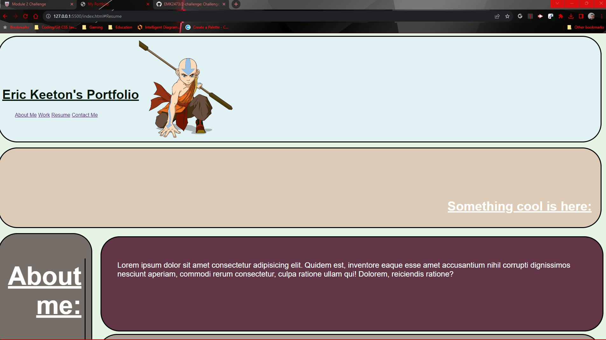
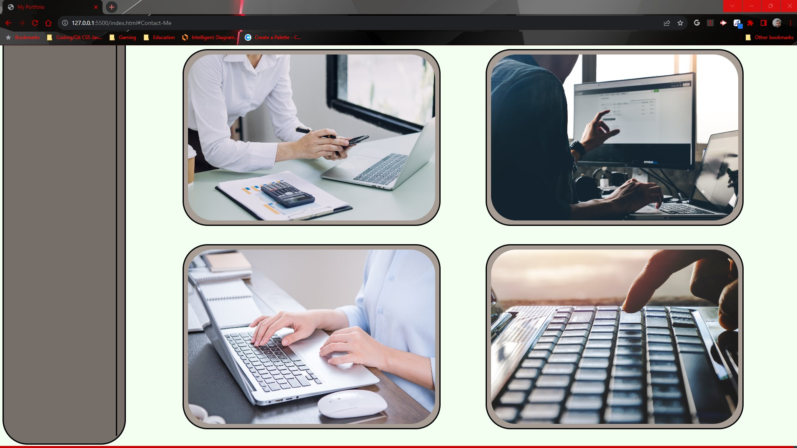
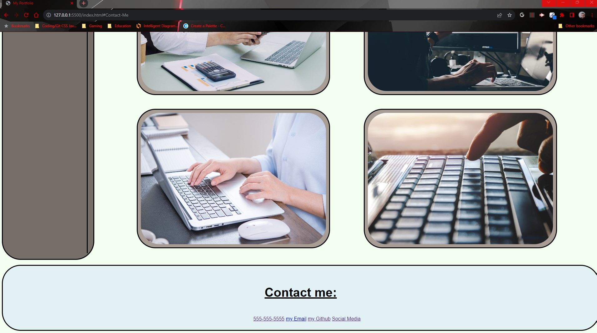

# 2-Challenge
## Homework Challenge 2
### In this challenge, I:
- Created a header that contains a title, an avatar, and anchored elements, that highlight when hovered, and are linked to their corresponding sites.
- Created a Nav bar that contains something cool.
- Created an aside to guide the user along with the image sections.
- Created a section and class for a paragraph about me in latin.
- Created a section containing the large image, that shrinks when hovered, and links to my previous challenge's deployed site.
- Created a section containing 4 smaller images, that grow when hovered, and link to my previous challenge's deployed site.
- Created a footer that contains anchored elements, that highlight when hovered, and link to their corresponding sites.
- Attempted to make all of this flex correctly with the proper media queries.

## Github repo link: https://github.com/EMK2473/2-challenge

## Deployed link: https://emk2473.github.io/2-challenge/

## Screenshot of deployed site:

