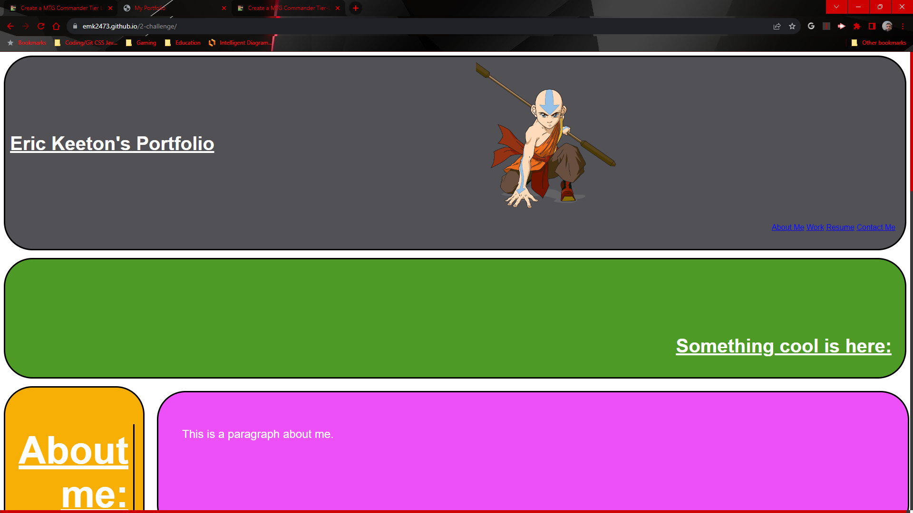

# 2-Challenge
## Homework Challenge 2
### In this challenge, I:
- Made a header, added a title, image, and navigation links to about me, my work, resume, and contact me.
- Created an aside to format the sections
- Created a section for a paragraph about me
- Created one large image that is interactable and linked to my previous challenge 
- Created a section with 4 smaller images that are interactable and are linked to my "other work" (I used hw-challenge-1 for each link; since it's the only work I have completed)
- Created a footer that is linked to the "contact me" in the nav bad
- Added links to each anchor in the footer for my phone number, email, github, and social media (used placeholder links for what I do not have)
- Set each large container to a flexbox, then styled and formatted each image, and section accordingly

## Github repo link: https://github.com/EMK2473/2-challenge

## Deployed link: https://emk2473.github.io/2-challenge/

## Screenshot of deployed site:

